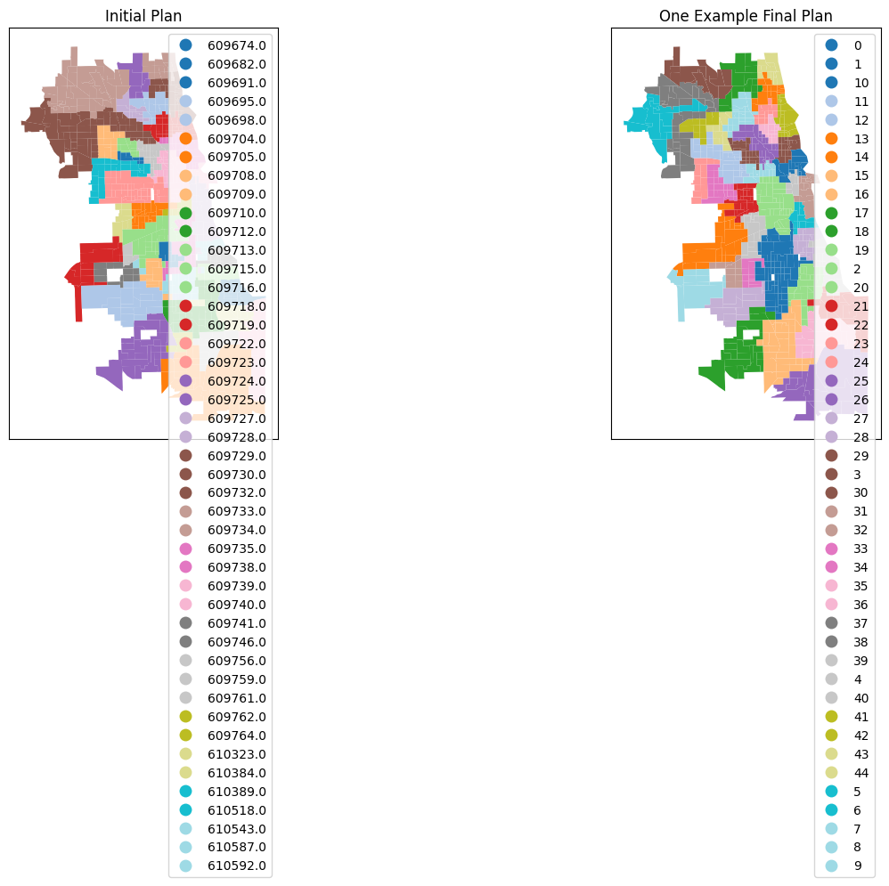
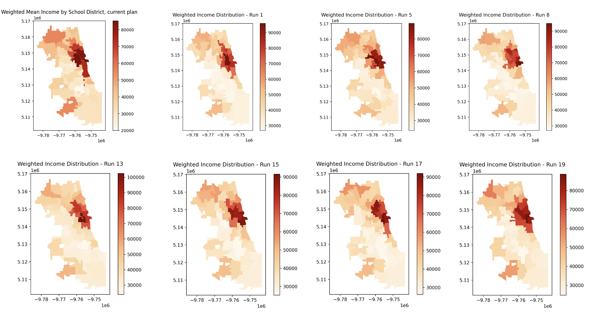

# School Redistricting and Income Composition of Student Populations in Chicago Public Schools: A Study Using Geospatial Markov Chain Monte Carlo Simulations

**Author:** Zixuan Zhou

**Email:** [zixuanzhou@uchicago.edu](mailto:zixuanzhou@uchicago.edu)


> ## Project Overview
> 
> This is a computational study examining how alternative school district boundaries (school redistricting) affect the income composition of student populations in Chicago Public Schools using **Markov Chain Monte Carlo (MCMC)** simulations. Like many district boundaries (for instance, voting), **school district boundaries are often strategically created** rather than randomly assigned, resulting in schools with different socioeconomic student body compositions. Using census data, school boundary surveys, and geospatial MCMC simulations, I investigate how **alternative district assignments** (compared to Chicago Public Schools high school attendance boundaries in academic year 2022-2023) **reshape the household income levels of students attending each individual school**. The project provides insights into how redistricting can lead to more equitable income distributions of student bodies across schools, thereby potentially impacting educational outcomes.
>
> **TL;DR:** I analyzed how alternative school attendance boundaries affects the potential income mix of students at each school. Some schools may gain more economically diverse student bodies, while others may see shifts toward different income brackets entirely.


## Research Question

**How do alternative school district assignments change the household income composition of student bodies at individual schools?**

Each school currently serves students from specific geographic boundaries. The attendance boundaries create distinct student bodies with particular socioeconomic characteristics. Through redistricting, it may be possible to alter which students attend which schools, thereby changing the income profile of each school's student population.

## Data

1. [Chicago Public Schools District Attendance Boundaries (2022-2023)](https://data.cityofchicago.org/Education/Chicago-Public-Schools-High-School-Attendance-Boun/fkiq-5i7q)
- **Period**: 2022-2023 school year
- **Coverage**: High school attendance boundaries only. It should be noted that a more ideal study would use elementary school boundaries which often operate under close enrollent policies. However, high school boundaries are still useful as a starting point for understanding districting effects. Since they often cover larger geographic areas, simulations are more computationally feasible.
- **Main Variables**: School ID (as unique district identifier), attendance boundaries geography

2. [American Community Survey (ACS) Data (2023)](https://www.census.gov/programs-surveys/acs.html)
- **Level**: Census tract level
- **Main Variables**: Population, individual income, tract ID (unique identifier)

3. [Census Bureau Shapefiles](https://www.census.gov/geographies/mapping-files/time-series/geo/tiger-line-file.html)
- **Level**: Census tract level
- **Main Variables**: Tract-level geography (spatial joints), water area (for removing outliers)


## Methodology

### MCMC with GerryChain
This study uses Markov Chain Monte Carlo (MCMC) simulations via the GerryChain algorithm (python package: `gerrychain`) to generate realistic alternative school district boundaries. The details of this algorithm can be found [here](https://gerrychain.readthedocs.io/en/latest/). Unlike simple bootstrapping, this method produces geographically sensible redistricting scenarios that **alters the existing school district boundaries (or a reasonable original partition scheme) one step at a time, while ensuring that the new boundaries remain contiguous and respect population constraints.**

Refer to this interesting [issue](https://github.com/mggg/GerryChain/issues/426) for a geospatial MCMC in process.

### Why MCMC for Redistricting?
The primary reason is that random assignment of students to schools would be unrealistic. We seldom see random school lotteries in real life. In practice, school boundaries must be geographically contiguous and centered around school locations. They also repsect certain constraints, such as covering a certain number of population. MCMC allows me to explore the space of all possible realistic district configurations while respecting geographic constraints.

### The GerryChain Process:
- **Preperation:** The algorithm builds network graph indicating adjacent geographic districts based on census tract boundaries.
- **Random selection and merge:** Given an original partition shceme, the algorithm randomly selects two adjacent existing districts and combines them into a new district.
- **Partition:** After combining the selected districts, the algorithm repartitions them using a random spanning tree and edge removal to split them according to specified constraints. In this study, the constraints include population balance and geographic contiguity.
- **Iteration:** Each step creates a new valid district configuration; 1,000 steps generate diverse alternatives assignment schemes. 

It should be noted that although each Markov Chain generation process might not be parallisable, we ultimately aim to generate multiple Markov Chains, which makes the process scalable. Repeating the process would generates hundreds of alternative boundary scenarios, creating a comprehensive sample of possible redistricting outcomes rather than just a few arbitrary alternatives.


## Repository Structure

```
├── 01-data-preparation.ipynb    
├── 02-mcmc-local.ipynb         
├── 03-mpi-parallel/            
│   ├── main.py                
│   ├── run.sbatch    
│   ├── batch_*/                # Output directories for each batch          
│   └── local-alternative.py    # Local test script for MCMC
├── 04-simple-docker/           # Dockerfile 
├── requirements.txt            # Python dependencies
└── README.md                   # This file
```

## File Descriptions

### 01-data-preparation.ipynb
In this file, I performed basic data cleaning for ACS, Census shapefile, and school district data. Then, I performed spatial joins to match census tracts to school districts. This step creates the primary dataset with geographic and demographic information which serves as the baseline for comparison with alternative redistricting scenarios.

### 02-mcmc-local.ipynb
This file implements a simple, local one-time MCMC simulation using `GerryChain`. The population constraints are set to be 40% deviation tolerance around the existing mean district population. This single Markov Chain contains 1,000-steps. The following graph shows an example of an alternative district assignment generated by the MCMC process.  




### 03-mpi-parallel/
**Justification for using large-scale computing:** Although our initial data size is manageable, performing geospatial analysis combined with simulating markov chains is computationally expensive. Moreover, since this project aims to ultimately generate hundreds of thousands of alternative district assignments, it is necessary to parallelize the MCMC process for efficiency and to scale up the simulations to explore as many scenarios as possible.

In this directory, I implemented a parallelized version of the MCMC simulation using MPI (Message Passing Interface) to scale the process across 20 midway cores (see `main.py`). Then, using batch commands, I scheduled the process to repeat 5 times, each time generating 20 Markov Chains (see run.sbatch), totaling up to 100 chains. The outcomes, including weighted income distributions and assignment schemes, are saved in separate directories for each batch (e.g., `batch_1/`, `batch_2/`, etc.).The total runtime for the entire process is approximately 60 seconds. This approach is easily scalable to hundreds of thousands of simulations, allowing for a grid-search-like analysis of how different redistricting scenarios affect income distributions across schools.


### 04-simple-docker/
In this directory, I provide a simple Dockerfile for containerizing the application. This allows for easy deployment in cloud environments, such as AWS batch or other serverless architectures. 

Due to the size of the dependencies required for this project, a simple lambda function is not sufficient in our case. The Docker image together has ~600mb in size, easily surpassing lambda's 250mb limit. Therefore, this container approach is necessary for deploying this application in a cloud environment.  

Currently, the Docker image still requires some development to solve dependency issues. Once it is complete, it will enable easier code replication worrying about local environment setup issues, which in this project was a significant challenge due to package compatibility issues with `GerryChain`, MPI, and other geospatial analysis dependencies for this project.


## Preliminary Results

Initial results show that currently, downtown schools saw a significant concentration of wealthy households, while some alternative district assignments generated through MCMC simulations may lead to more equitable income distributions across schools. This suggest that alternative school district boundaries could lead to more equitable income distribution across schools, which could potentially reduce socioeconomic segregation in education. 

 
*This graph compares the income profile of student's families under existing assignment (top left) with that under alternative assignments.*


## Replication

### Requirements
- Python 3.11
- For all dependencies and their versions, see `requirements.txt` for complete package list
- **Note**: Even with the specified versions, `GerryChain` may still run into compatibility issues with some packages. One side note is that the creators of `GerryChain` recommend using `pip` to install the package, even if using a conda environment. This is because `GerryChain` is not maintained for conda anymore. 

### Local Testing
After creating a virtual environment using `venv` (recommended), run the following commands to set up the environment and test the MCMC simulation for school redistricting locally. 

```bash
# Install dependencies
pip install -r requirements.txt

# Local testing using 8 cores
mpirun -n 8 python 03-mpi-parallel/local-alternative.py
```

### Running School Redistricting MCMC on Midway Cluster

To configure `main.py` in `03-mpi-parallel/` to run on Midway Cluster, first load python and mpi modules. Then, create a conda environment specifying Python 3.11 and activate it. Then, install the required packages besides `gerrychain` in the enironment in `requirements.txt` using conda. Still install `gerrychain` using `pip` to avoid compatibility issues. 

When running into installation conflicts, downgrade `pandas` to `1.26.4` as a possible workaround.


When the environment is ready, run the following commands to execute the MCMC simulations in parallel on the Midway cluster. 

```bash
cd 03-mpi-parallel/
sbatch run.sbatch
```


## Citing This Repo

Zhou, Z. (2025). School Redistricting and Income Composition of Student Populations in Chicago Public Schools: A Study Using Geospatial Markov Chain Monte Carlo Simulations. GitHub. https://github.com/macs30123-s24/final-project-zixuan-zhou-123.git

