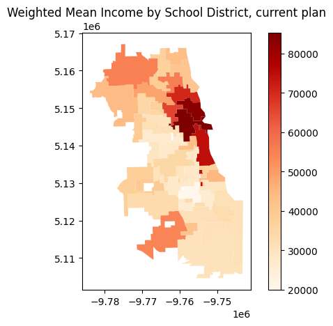

# School Redistricting and Income Composition of Student Populations in Chicago Public Schools
## A Study Using Geospatial Markov Chain Monte Carlo Simulations

**Zixuan Zhou**
[zixuanzhou@uchicago.edu](mailto:zixuanzhou@uchicago.edu)

---
## Overview

I analyzed how alternative school attendance boundaries affects the potential income mix of students at each school using geospatial Markov Chain Monte Carlo (MCMC) simulations. 

---

## Research Question

**How do alternative school district assignments change the household income composition of student bodies at individual schools?**

- School boundaries create distinct student bodies with specific socioeconomic characteristics
- Redistricting can alter which students attend which schools
- Focus: How boundary changes reshape student (their families') income profiles at each school

---

## Why This Matters

- School district boundaries are often **strategically created**, not random
- This results in very uniformed within-school socioeconomic compositions
- Could alternative boundaries create a more diverse student profile body?

---

## Data

1. **Chicago Public Schools Boundaries (2022-2023)**
   - High school attendance boundaries
   - School IDs and geographic boundaries

2. **American Community Survey (2023)**
   - Census tract level 
   - Population demographics and median individual income

3. **Census Bureau Shapefiles**
   - Geographic boundaries for spatial analysis
   - Enables contiguity constraints

---

## Methodology - Why MCMC?

**Problem with bootstrapping:**
- Random assignment = unrealistic (no geographic logic)
- Need boundaries that are **geographically contiguous**
- Must respect **population constraints**

**MCMC with GerryChain:**
- Explores space of all possible **realistic** district configurations

---

## The MCMC Process

**ReCom Algorithm Steps:**
1. **Random Selection:** Pick two adjacent districts
2. **Merge:** Combine them temporarily  
3. **Spanning Tree:** Create random tree across census tracts
4. **Split:** Remove edge to create two new districts
5. **Validate:** Check population balance (±40% tolerance)
6. **Iterate:** Repeat 1,000 times

The result is hundreds of realistic alternative boundary scenarios

---

---
## Scaling Up

MCMC with geospatial data is computationally intensive, so I used parallel processing to scale up the simulations on Midway Cluster:

- **Single Chain:** 1,000 steps
- **Parallel Implementation:** MPI with 20 cores on Midway cluster  
- **Batch Processing:** 5 batches × 20 chains = 100 total simulations
- **Runtime:** ~60 seconds total (100 simulations)
- Scalable by increasing batch size or number of chains per batch

---

---
## Preliminary Results

- **Current:** Downtown schools likely saw a significant concentration of wealthy households
- **Alternative boundaries:** More equitable income distributions across all schools
- **Implication:** Redistricting could reduce socioeconomic segregation as students would attend school with peers from different income backgrounds. This also mean better equal education opportunities. 

---

## Impact

- Quantitative evidence of how boundaries lead to spatial sorting and sometimes socioeconomic segregation
- Computational framework for evaluating redistricting scenarios and policy tool for school boundary decisions

---

## Replication Challenges & Solutions

**Package Compatibility Issues:**
- **GerryChain**: not maintained for conda anymore, use `pip` instead in all environments
- **MPI + Geospatial**: dependency conflicts
- **Working Environment**: Python 3.11 + specific package versions in `requirements.txt`

**Cloud Deployment:**
- **Midway Cluster**: trouble shooting describe in `README.md`
- **Alternative**: Docker containerization for cloud deployment

---

# Thank you!

